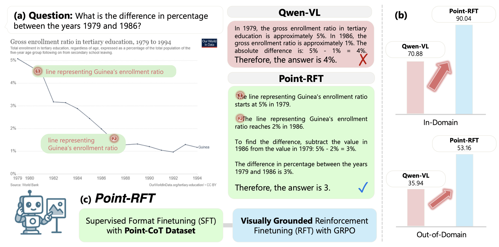
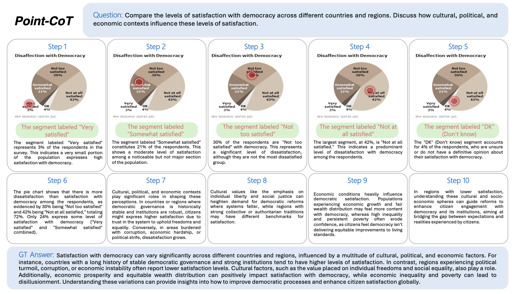
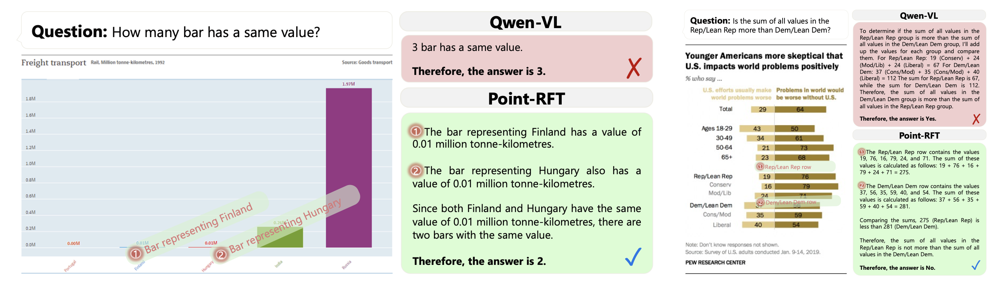
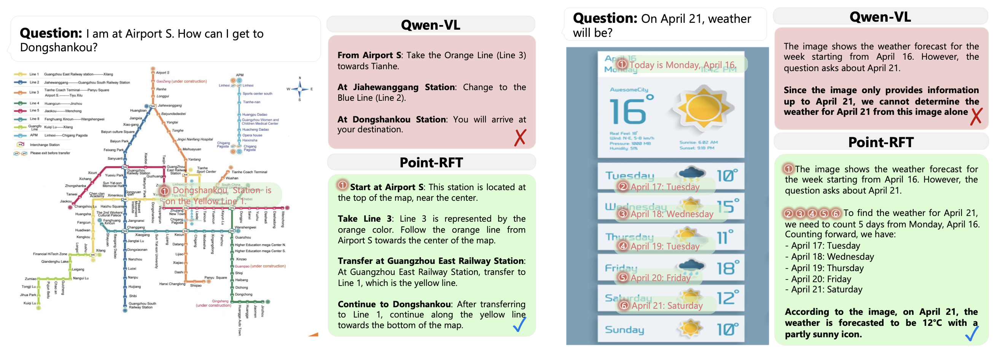

# Point-RFT: Improving Multimodal Visual Reasoning with Visually Grounded Thoughts in Reinforcement Learning


Official implementation of "Point-RFT: Improving Multimodal Visual Reasoning with Visually Grounded Thoughts in Reinforcement Learning".

[](https://arxiv.org/abs/2505.19702)
[](https://kodenii.github.io/point-rft-web/)



## 🌟 Key Features

* **Visually Grounded Reinforcement Finetuning (Point-RFT):** A novel multimodal reasoning framework explicitly designed for visually grounded reinforcement fine-tuning.
* **Enhanced Multimodal CoT:** Empirically demonstrates that "visually grounded CoT" is more effective for multimodal reasoning compared with text-only thoughts.
* **Point-CoT Dataset:** A curated 71K-example dataset where every reasoning step is aligned with point-level visual references, enabling supervised format finetuning that teaches the model to "think while pointing".
* **Superior Generalization:** Demonstrates strong generalization ability and interpretability on five out-of-domain benchmarks.

## ⚙️ How it Works

Point-RFT employs a two-stage training framework:

1.  **Supervised Format Finetuning (SFT) with Point-CoT Dataset:**
    * We first construct a Point-CoT dataset of 71K examples. This dataset integrates step-by-step text rationales with explicit grounding to visual points.
    * The dataset generation involves GPT-4o for CoT generation and Molmo-7B for point grounding, with cross-validation to ensure consistency.
    * A base model (Qwen2.5-VL) is fine-tuned on this dataset to generate step-by-step reasoning traces explicitly linked to visual pointing. This mitigates hallucinations and enhances perception-reasoning alignment.
    * The model learns to output in a specific format: `<think> <points...>...</points> ... </think> <answer>...</answer>`.

2.  **Visually Grounded Reinforcement Finetuning (RFT) with GRPO:**
    * The SFT model is further optimized using Reinforcement Learning (RL).
    * We use the Group-wise Relative Policy Optimization (GRPO) algorithm.
    * Dual rewards are implemented:
        * **Format Reward ($R_f$):** Measures structural adherence to the template.
        * **Accuracy Reward ($R_a$):** Computes answer correctness against the ground truth.
    * This stage optimizes answer correctness and grounded rationale coherence by rewarding localized visual-textual reasoning paths.

## 📊 Point-CoT Dataset

* The Point-CoT dataset comprises 71K images covering diverse question types (e.g., counting, comparison, arithmetic) from a subset of Mammoth-VL.
* Each instance integrates the reasoning process with point grounding, creating a novel form of multimodal CoT.
* The pipeline ensures spatial-textual consistency through cross-validation between GPT-4o (reasoning) and Molmo-7B (grounding).



## 🏆 Case Study

### Chart Domain


### General Domain


## 🚂 Installation and Training

We follow EasyR1's installation and training.

### Setup

```bash
pip install -e .
```

### GRPO Training

```bash
bash examples/qwen2_5_vl_7b.sh
```

### Merge Checkpoint in Hugging Face Format

```bash
python3 scripts/model_merger.py --local_dir /path/to/checkpoints
```

We have taken note of the training instability issue with GRPO. We have selected the last checkpoint before the training collapse and will continue working to resolve this problem in the future.

## 💾 Dataset and Pretrained Models
[Link](https://drive.google.com/file/d/1Nk3WV203ZXsu_CAQHCpIEkge0cck0U2u/view?usp=share_link) to download the Point-CoT dataset. For images part, please refer to the [Mammoth-VL](https://mammoth-vl.github.io) dataset.

[Link](https://huggingface.co/kodenii/Point-SFT) to download the pretrained model checkpoints for Point-SFT.

[Link](https://huggingface.co/kodenii/Point-RFT) to download the pretrained model checkpoints for Point-RFT.


## 🤝 Acknowledgements
* This work utilizes the Qwen2.5-VL model as a backbone.

* The Point-CoT dataset generation leverages GPT-4o and Molmo-7B.

* Experiments are run on benchmark datasets including ChartQA, CharXiv, PlotQA, IconQA, TabMWP, and a counting dataset based on SuperCLEVR.

* The implementation uses PyTorch and Easy-R1.

## 📄 Citation
If you find Point-RFT useful in your research, please consider citing our paper:

    @article{ni2025pointrft,
      title={Point-RFT: Improving Multimodal Reasoning with Visually Grounded Reinforcement Finetuning},
      author={Minheng Ni, Zhengyuan Yang, Linjie Li, Chung-Ching Lin, Kevin Lin, Wangmeng Zuo, Lijuan Wang},
      journal={arXiv preprint arXiv:2505.19702},
      year={2025}
    }